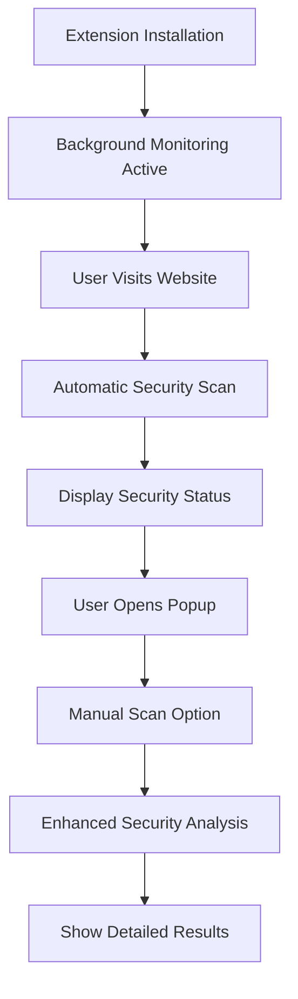

# UNSCAMMED.AI Chrome Extension - Product Requirements Document

## 1. Product Overview

UNSCAMMED.AI is a production-grade Chrome browser extension designed to provide real-time phishing detection and website security analysis. The extension serves as a foundational security layer that monitors user browsing activity and provides instant feedback on potentially malicious websites.

The extension targets everyday internet users who need protection from phishing attacks, malicious websites, and online scams. It provides a seamless browsing experience while maintaining robust security monitoring in the background.

## 2. Core Features

### 2.1 User Roles

| Role | Registration Method | Core Permissions |
|------|---------------------|------------------|
| Browser User | Extension installation | Can scan websites, view security status, access popup interface |

### 2.2 Feature Module

Our UNSCAMMED.AI extension consists of the following essential pages and components:

1. **Popup Interface**: Security status display, manual scan trigger, extension controls
2. **Background Monitoring**: Automatic URL logging, navigation tracking, security analysis
3. **Content Integration**: Page-level security scanning, real-time threat detection
4. **Utility Functions**: Domain analysis, security checks, data processing

### 2.3 Page Details

| Page Name | Module Name | Feature description |
|-----------|-------------|---------------------|
| Popup Interface | Security Status Display | Show current website security status with visual indicators and threat level |
| Popup Interface | Manual Scan Button | Trigger immediate security scan of active tab with one-click action |
| Popup Interface | Extension Title | Display "🛡️ UNSCAMMED.AI" branding with initialization status |
| Background Service | URL Logging | Automatically log and track all visited URLs for security analysis |
| Background Service | Navigation Monitoring | Listen for page navigation events and trigger security checks |
| Background Service | Message Routing | Send security data between background and content scripts |
| Content Script | Page Scanner | Analyze current page content and domain for security threats |
| Content Script | Threat Detection | Identify potential phishing indicators and malicious elements |
| Content Script | Alert System | Display security warnings and scan results to user |
| Utility Functions | Domain Analysis | Evaluate domain reputation and security risk factors |
| Utility Functions | Security Checks | Perform local security validation and threat assessment |

## 3. Core Process

**Primary User Flow:**
1. User installs extension and it initializes automatically
2. Extension monitors browsing activity in background
3. When user visits a website, automatic security scan occurs
4. User can manually trigger additional scans via popup
5. Extension displays security status and warnings as needed

**Manual Scan Flow:**
1. User clicks extension icon to open popup
2. User sees current security status
3. User clicks "Scan This Site" button
4. Extension performs immediate security analysis
5. Results displayed in popup and/or content area

## 4. User Interface Design

### 4.1 Design Style

- **Primary Color**: Red accent (#c00) for security alerts and branding
- **Secondary Colors**: Clean whites and grays for neutral interface elements
- **Button Style**: Minimalistic flat design with subtle hover effects
- **Font**: System default sans-serif fonts for maximum compatibility
- **Layout Style**: Clean, compact popup design optimized for browser extension constraints
- **Icon Style**: Shield-based security iconography with modern flat design

### 4.2 Page Design Overview

| Page Name | Module Name | UI Elements |
|-----------|-------------|-------------|
| Popup Interface | Header Section | Bold red title "🛡️ UNSCAMMED.AI" with shield emoji, clean typography |
| Popup Interface | Status Display | "Browser Shield Initialized" text with security status indicator |
| Popup Interface | Action Button | Red-accented "Scan This Site" button with hover effects and click feedback |
| Popup Interface | Layout Container | Compact 300px width popup with proper padding and spacing |

### 4.3 Responsiveness

The extension is designed as a browser popup with fixed dimensions optimized for desktop Chrome browsers. The interface maintains consistent sizing and layout across different screen resolutions while ensuring readability and usability within the popup constraints.