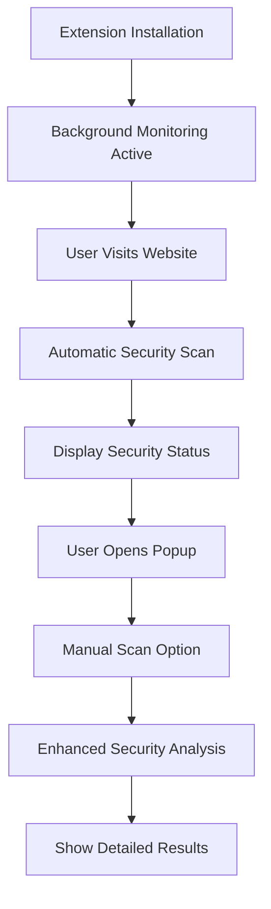

# UNSCAMMED.AI Chrome Extension – Product Requirements

## 1. Product Overview

UNSCAMMED.AI is a prototype Chrome browser extension that demonstrates client-side heuristics for identifying suspicious websites. It monitors the user’s navigation activity, evaluates each page locally, and surfaces warnings when potential phishing characteristics are detected.

The extension targets privacy-conscious users who want lightweight warnings without sending browsing history to remote services. All scans run locally in the browser, and only a minimal popup UI is provided.

## 2. Core Features

### 2.1 User Role

Only one role exists: the **browser user**. Installing the extension grants access to:

- Automatic background scans on navigation.
- Manual scans initiated from the popup.
- Read-only status indicators (total scans, last result).

### 2.2 Feature Modules

1. **Background monitoring** – captures top-level navigation events, logs URLs, and proxies scan requests between the popup and content script.
2. **Content analysis** – evaluates the current page using heuristic checks (HTTPS usage, suspicious domains, phishing phrases, brand spoofing, insecure forms, suspicious external links) and renders alerts.
3. **Popup interface** – displays the active tab URL, most recent threat assessment, and scan counters; exposes the “Scan This Site” action.
4. **Utility helpers** – reusable URL-inspection functions collected under `utils/urlCheck.js`.

### 2.3 UI and Feedback Details

| Surface | Element | Description |
|---------|---------|-------------|
| Popup | Header | Shows "🛡️ UNSCAMMED.AI" and an “Initialized” status light. |
| Popup | Status card | Displays active tab URL, threat level icon/text, and total scan count sourced from `chrome.storage.local`. |
| Popup | Scan button | Sends a `MANUAL_SCAN` request for the active tab and updates once the content script replies. |
| Content script | Automatic alert banner | Appears for 10 seconds on high-risk classifications determined during navigation scans. |
| Content script | Manual scan toast | Temporarily overlays the result of a manual scan, colour-coded by risk level. |

## 3. Core Process

**Primary User Flow:**
1. User installs the extension; default settings and counters are stored in `chrome.storage.local`.
2. As the user navigates, the background worker logs each main-frame URL and asks the content script to scan it.
3. The content script evaluates the URL and responds with a threat level (low/medium/high/unknown).
4. High-risk detections trigger an alert banner on the page.
5. Scan metadata is persisted for popup reporting.

**Manual Scan Flow:**
1. User opens the popup, which queries the active tab and current totals.
2. User presses **Scan This Site**.
3. The popup sends a `MANUAL_SCAN` request to the background worker, which forwards it to the content script.
4. The content script runs enhanced checks (page text, form actions, external links) before returning a result.
5. The popup updates its status indicators; the content script shows a toast; counters increment in storage.

## 4. User Interface Design

### 4.1 Design Style

- **Primary accent**: Red (`#c00`) used for warning states and primary actions.
- **Supporting colours**: Neutral grays and white backgrounds to keep focus on status indicators.
- **Typography**: System sans-serif fonts for compatibility and minimal bundle size.
- **Layout**: Fixed-width popup (≈300 px) with stacked sections; content script overlays use fixed positioning.

### 4.2 Responsiveness

The popup is optimized for desktop Chrome. Elements are fixed in place; no mobile breakpoints are required. In-page alerts and toasts use absolute positioning so they remain visible regardless of page layout.