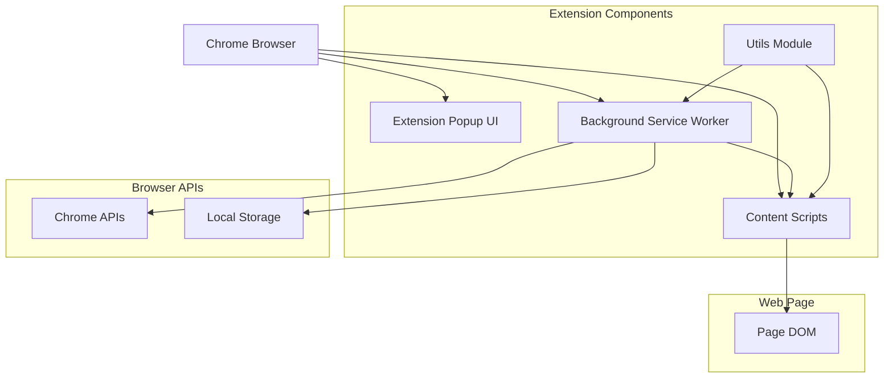
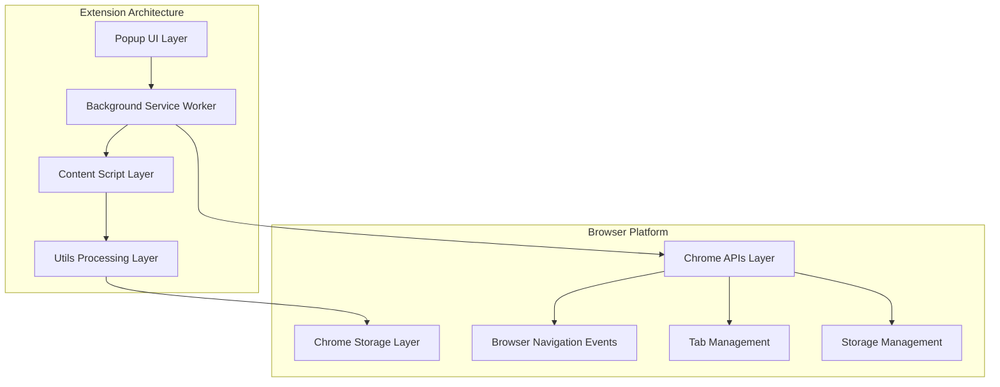
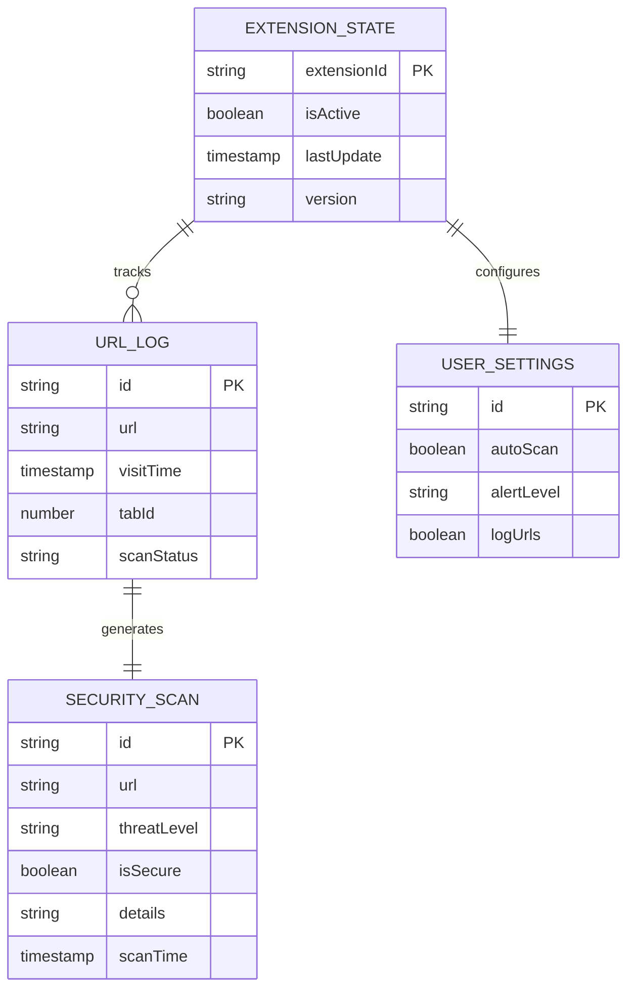

# UNSCAMMED.AI Chrome Extension - Technical Architecture Document

## 1. Architecture Design



## 2. Technology Description

- **Language / UI**: Vanilla JavaScript, HTML5, CSS3 (no bundler)
- **Extension Framework**: Chrome Manifest V3 with a service worker background script
- **Storage**: `chrome.storage.local` for visit history, scan counters, and results
- **Messaging**: `chrome.runtime.sendMessage`, `chrome.runtime.onMessage`, and `chrome.tabs.sendMessage`
- **Navigation Hooks**: `chrome.webNavigation.onCompleted` for top-level page loads

## 3. Module Responsibilities

| File | Role |
|------|------|
| `manifest.json` | Declares MV3 entry points, permissions (`webNavigation`, `storage`, `activeTab`), and popup assets. |
| `background.js` | Initializes default state, logs navigation events, forwards scan requests to the content script, stores scan outcomes, and answers popup queries. |
| `content.js` | Runs heuristic checks (HTTPS usage, suspicious domains, phishing keywords, brand spoofing, DOM form/link/content analysis) and renders banners/toasts. |
| `popup/` | Presents the active tab status, total scan count, and manual scan button; dispatches popup events via runtime messaging. |
| `utils/urlCheck.js` | Provides reusable URL inspection helpers (protocol security, domain reputation, phishing indicators) shared by other scripts when bundled. |

## 4. Integration Points

### 4.1 Chrome APIs

| API | Usage |
|-----|-------|
| `chrome.webNavigation.onCompleted` | Triggers automatic scans after the main frame finishes loading. |
| `chrome.tabs.sendMessage` | Sends `URL_SCAN` and `MANUAL_SCAN` requests to the content script and receives responses. |
| `chrome.runtime.onMessage` | Handles popup requests (`MANUAL_SCAN`, `GET_SCAN_STATUS`) inside the background worker. |
| `chrome.tabs.query` | Fetches the active tab URL for popup display. |
| `chrome.storage.local` | Persists extension state (`extensionState`), user settings (`userSettings`), visit history (`urlHistory`), and individual scan documents (`scan_<id>`). |

### 4.2 Message Contracts

Background ➜ Content (`URL_SCAN`):
```javascript
{
  type: "URL_SCAN",
  url: string,
  tabId: number,
  timestamp: number
}
```

Content ➜ Background (`SCAN_RESULT`):
```javascript
{
  type: "SCAN_RESULT", 
  url: string,
  isSecure: boolean,
  threatLevel: "low" | "medium" | "high",
  details: string
}
```

## 5. Server Architecture Diagram



## 6. Data Model

### 6.1 Data Model Definition



### 6.2 Storage Keys

- `extensionState`: `{ isActive, version, lastUpdate, totalScans }` – created during installation/startup and updated when scans finish.
- `userSettings`: `{ autoScan, alertLevel, logUrls, showNotifications, scanTimeout }` – defaults stored on install; not yet exposed in the UI.
- `urlHistory`: `Array<URL_HISTORY>` – appended for each main-frame navigation, truncated to the most recent 100 records.
- `scan_<generatedId>`: `SCAN_RESULT` objects persisted per scan (automatic or manual).

Example persistence flow:
```javascript
// URL visit tracking
const urlLog = {
  id: generateId(),
  url: "https://example.com",
  visitTime: Date.now(),
  tabId: 123,
  scanStatus: "completed",
  threatLevel: "low"
};

// Store in chrome.storage.local with array management
chrome.storage.local.get(['urlHistory'], (result) => {
  const history = result.urlHistory || [];
  history.push(urlLog);
  chrome.storage.local.set({ urlHistory: history });
});

chrome.storage.local.set({ [`scan_${result.id}`]: result });

chrome.storage.local.get(['extensionState'], ({ extensionState }) => {
  if (extensionState) {
    extensionState.totalScans += 1;
    chrome.storage.local.set({ extensionState });
  }
});
```

