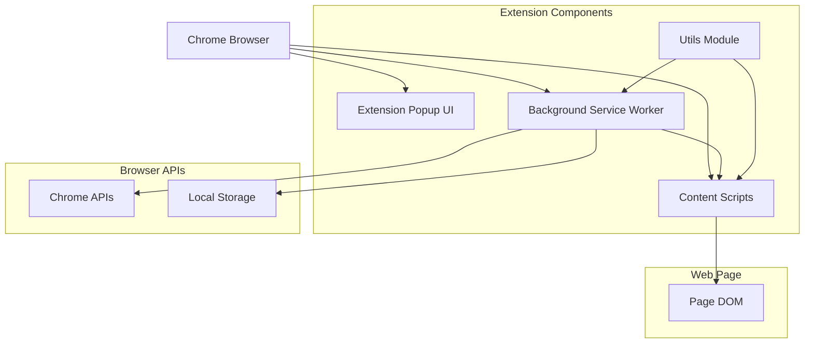
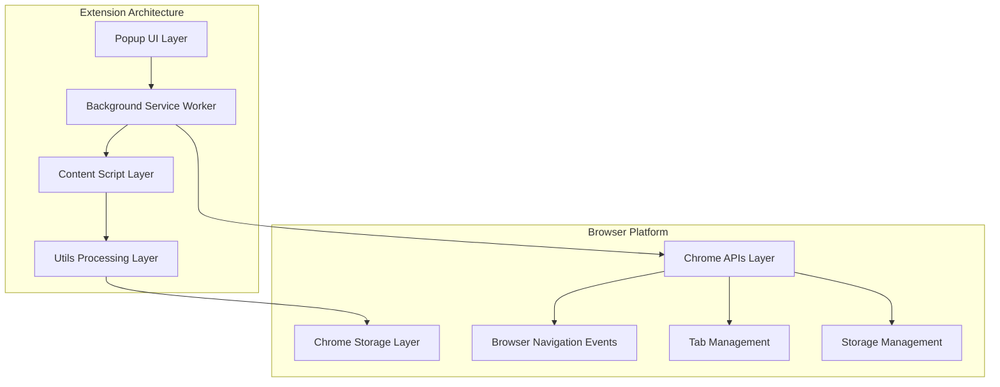
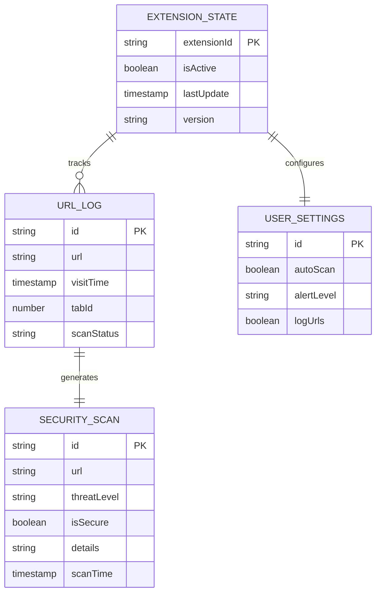

# UNSCAMMED.AI Chrome Extension - Technical Architecture Document

## 1. Architecture Design



## 2. Technology Description

* **Frontend**: Vanilla JavaScript + HTML5 + CSS3

* **Extension Framework**: Chrome Manifest V3

* **Build System**: None (plain files for instant loading)

* **Storage**: Chrome Extension Storage API

* **Communication**: Chrome Message Passing API

## 3. Route Definitions

| Route             | Purpose                                                     |
| ----------------- | ----------------------------------------------------------- |
| popup/popup.html  | Main extension popup interface for user interaction         |
| background.js     | Service worker for background processing and API management |
| content.js        | Injected script for page-level security analysis            |
| utils/urlCheck.js | Utility functions for domain and security validation        |

## 4. API Definitions

### 4.1 Core API

**Chrome Extension APIs Used:**

```
chrome.webNavigation.onCompleted
```

Purpose: Monitor page navigation events
Parameters: Navigation details including URL, tab ID, frame ID

```
chrome.tabs.sendMessage
```

Purpose: Send security data from background to content script
Parameters: Tab ID, message object with URL and scan results

```
chrome.tabs.query
```

Purpose: Get active tab information for manual scans
Parameters: Query object to identify current active tab

**Internal Message API:**

Background to Content Script Communication:

```javascript
{
  type: "URL_SCAN",
  url: string,
  tabId: number,
  timestamp: number
}
```

Content Script Response:

```javascript
{
  type: "SCAN_RESULT", 
  url: string,
  isSecure: boolean,
  threatLevel: "low" | "medium" | "high",
  details: string
}
```

## 5. Server Architecture Diagram



## 6. Data Model

### 6.1 Data Model Definition



### 6.2 Data Definition Language

**Chrome Extension Storage Schema:**

Extension State Storage:

```javascript
// Extension configuration and state
const extensionState = {
  isActive: true,
  version: "1.0.0",
  lastUpdate: Date.now(),
  totalScans: 0
};

// Store in chrome.storage.local
chrome.storage.local.set({ extensionState });
```

URL Logging Storage:

```javascript
// URL visit tracking
const urlLog = {
  id: generateId(),
  url: "https://example.com",
  visitTime: Date.now(),
  tabId: 123,
  scanStatus: "completed",
  threatLevel: "low"
};

// Store in chrome.storage.local with array management
chrome.storage.local.get(['urlHistory'], (result) => {
  const history = result.urlHistory || [];
  history.push(urlLog);
  chrome.storage.local.set({ urlHistory: history });
});
```

Security Scan Results:

```javascript
// Security analysis results
const scanResult = {
  id: generateId(),
  url: "https://example.com",
  isSecure: true,
  threatLevel: "low",
  details: "Domain verified, no threats detected",
  scanTime: Date.now(),
  scanType: "automatic" // or "manual"
};

// Store scan results
chrome.storage.local.set({ [`scan_${scanResult.id}`]: scanResult });
```

User Settings:

```javascript
// User preferences and configuration
const userSettings = {
  autoScan: true,
  alertLevel: "medium", // low, medium, high
  logUrls: true,
  showNotifications: true,
  scanTimeout: 5000
};

// Initialize default settings
chrome.storage.local.set({ userSettings });
```

